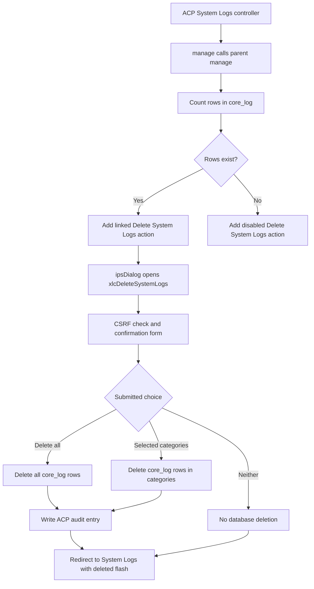
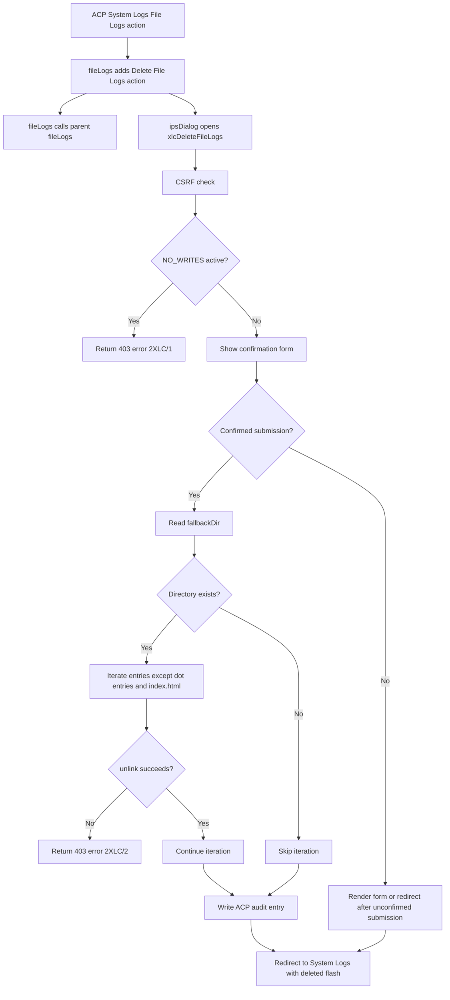
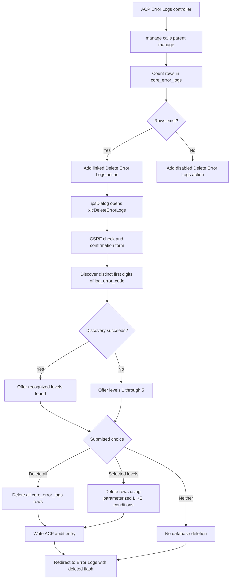
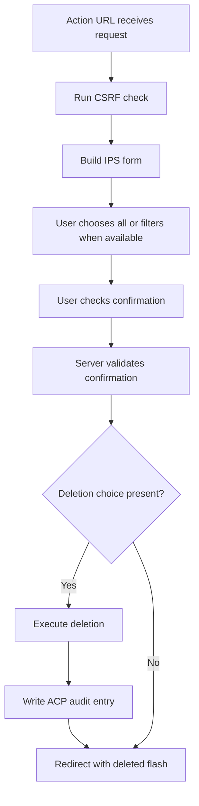

# Flow: X Log Cleaner

## Entry Points

### System Logs Page

### Error Logs Page

## Form Flow (all three delete dialogs)

## Hook Exception Flow

Each hooked method catches `\Error` and `\RuntimeException`. If the parent class has a method with the same name, the hook calls that parent method with the original arguments. Otherwise, it rethrows the exception.
